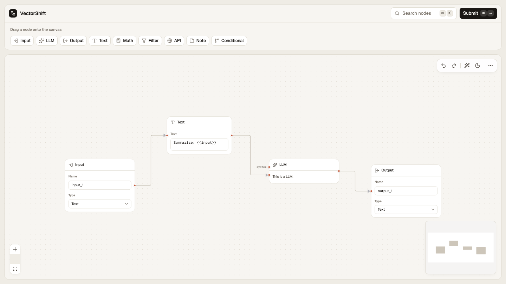
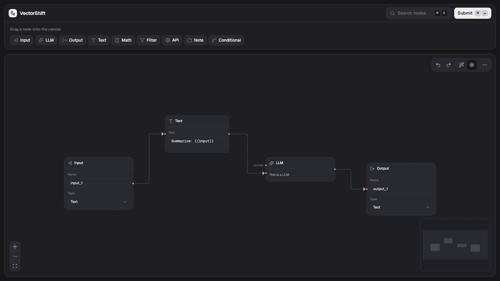

# VectorShift Pipeline Builder

A visual pipeline builder — drag nodes onto a canvas, wire them together, and submit the graph to a backend that validates it.

<p>
  <em>Submitted for the</em> <strong>VectorShift Frontend Technical Assessment</strong>
  <em>by</em> <a href="https://vectorshift.ai"><em>VectorShift</em></a>.
  &nbsp;·&nbsp;
  <a href="./ASSIGNMENT.pdf">Original brief</a>
</p>



<details>
<summary>Dark mode</summary>



</details>

> A full walkthrough video was submitted alongside this repo.

## What it does

The brief had four parts:

1. **A reusable node abstraction.** Every node is a small config object — title, icon, fields, handles — rendered by one shared component. Adding a node means editing data, not writing a new component. Ships with the 5 originals plus 5 new ones (Math, Filter, API, Note, Conditional).
2. **A clean, consistent design.** One warm, minimal theme across every node and control, with light and dark modes.
3. **A smarter Text node.** It grows to fit its text as you type, and writing a `{{variable}}` adds a matching input handle automatically.
4. **Backend integration.** Submit sends the graph to a FastAPI service that returns the node count, edge count, and whether it's a valid DAG (no loops) — shown back in the UI.

A few extras on top of the brief: undo / redo, a command palette (⌘K), save / load, auto-layout, connection validation, and keyboard shortcuts.

## Run it

Two terminals.

**Backend** — FastAPI on port 8000:

```bash
cd backend
pip install -r requirements.txt
uvicorn main:app --reload
```

**Frontend** — Vite:

```bash
cd frontend
npm install
npm run dev
```

Open the URL Vite prints (usually <http://localhost:5173>), build a pipeline, and hit **Submit**.

## Where things live

| Path | What's there |
|---|---|
| `frontend/src/nodes/registry.js` | Every node, defined as config |
| `frontend/src/nodes/BaseNode.jsx` | The one component that renders them all |
| `frontend/src/nodes/textNode.jsx` | The Text node (variables → handles) |
| `frontend/src/store.js` | App state |
| `backend/main.py` | The submit endpoint and DAG check |

Built with React, [@xyflow/react](https://reactflow.dev), zustand, and Tailwind on the frontend; FastAPI on the backend.
